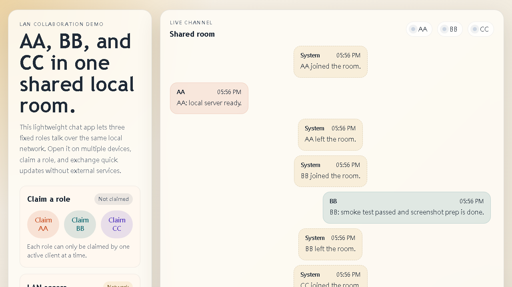
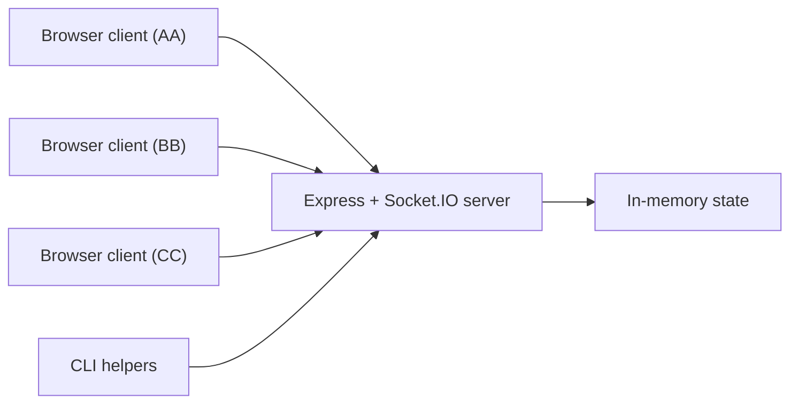

# AA BB LAN Chat

[](https://github.com/a123456789040-creator/aa-bb-lan-chat/actions/workflows/ci.yml)
[](https://github.com/a123456789040-creator/aa-bb-lan-chat/releases)
[](./LICENSE)

A small, inspectable LAN chat app for three fixed participants: `AA`, `BB`, and `CC`.

AA BB LAN Chat is a lightweight realtime collaboration demo built with Node.js, Express, and Socket.IO. It is designed to be easy to run, easy to inspect, and easy to extend. The project works well as:

- A local collaboration tool for three fixed roles on the same network
- A compact reference implementation for Socket.IO chat patterns
- A starter project for experimenting with presence, role claiming, and lightweight team workflows



## Why This Project Exists

Many chat demos are either too toy-like to be useful or too large to study quickly. This project aims for the middle ground: a small codebase with enough real behavior to be a practical reference.

It includes:

- Fixed role ownership
- Presence tracking
- Typing indicators
- LAN address discovery
- CLI tooling for scripted interactions and smoke tests

## Project Snapshot

| Area | Details |
| --- | --- |
| Stack | Node.js, Express, Socket.IO, plain HTML/CSS/JS |
| Runtime | Local machine or trusted LAN |
| Roles | `AA`, `BB`, `CC` |
| State | In-memory message history |
| Test coverage | End-to-end smoke test via Node clients |
| Primary use | Demo app, reference implementation, local coordination |

## Demo Flow

1. Start the server with `npm start`.
2. Open the app on one or more devices on the same LAN.
3. Claim `AA`, `BB`, or `CC`.
4. Exchange messages in real time.
5. Use `npm run demo:seed` to populate a quick example conversation for screenshots or demos.

## Features

- Fixed role claiming for `AA`, `BB`, and `CC`
- Live chat with Socket.IO over the local network
- Presence indicators so you can see which roles are occupied
- Typing status updates
- In-memory message history for recent messages
- LAN URL discovery via private IPv4 addresses
- CLI helpers for smoke testing, history reads, and scripted message sending

## Quick Start

Requirements:

- Node.js 18 or newer

Install dependencies:

```bash
npm install
```

Start the server:

```bash
npm start
```

Open the app in your browser:

```text
http://localhost:3000
```

If your machine has a private LAN address, the server will also print URLs such as:

```text
http://192.168.x.x:3000
```

Devices on the same LAN can open that URL and claim one of the three roles.

## Architecture



## Available Scripts

- `npm start`: start the server
- `npm run dev`: restart automatically when `server.js` changes
- `npm run smoke`: launch the server and verify that AA, BB, and CC can connect and exchange messages
- `npm run history`: print recent message history as JSON
- `npm run demo:seed`: send a short demo conversation to a running server
- `npm test`: alias for the smoke test

## Command-Line Helpers

Send a message from a file:

```bash
node scripts/send-chat.js --role AA --file ./message.txt
```

Send a message inline:

```bash
node scripts/send-chat.js --role BB --text "Update accepted."
```

Read the last 10 messages from a running server:

```bash
node scripts/read-history.js --limit 10
```

Use a custom server URL:

```bash
node scripts/send-chat.js --role CC --url http://127.0.0.1:3010 --text "Ready."
```

Seed a running server with example messages for demos or screenshots:

```bash
npm run demo:seed -- --url http://127.0.0.1:3000
```

## Environment Variables

- `PORT`: server port, defaults to `3000`
- `HOST`: bind host, defaults to `0.0.0.0`

Example:

```bash
PORT=3010 HOST=0.0.0.0 npm start
```

PowerShell:

```powershell
$env:PORT = 3010
$env:HOST = "0.0.0.0"
npm start
```

## HTTP Endpoints

- `GET /`: chat UI
- `GET /api/network`: LAN address information and suggested URLs
- `GET /healthz`: lightweight health check

## Project Structure

```text
aa-bb-lan-chat/
|- public/
|  |- app.js
|  |- index.html
|  `- styles.css
|- scripts/
|  |- read-history.js
|  |- send-chat.js
|  `- smoke-test.js
|- server.js
`- package.json
```

## Limits and Tradeoffs

- Message history is stored in memory only
- There is no authentication beyond claiming one of the fixed roles
- Only three roles are supported out of the box
- This project is meant for trusted local networks, not internet exposure

## Good Fit For

- Learning or teaching Socket.IO fundamentals
- Prototyping a lightweight local coordination tool
- Demonstrating role-based presence in a compact codebase
- Testing small workflow ideas before moving into a larger app

## Roadmap

- Add optional persistent storage for recent message history
- Support configurable role names or room presets
- Add lightweight access controls for shared LAN environments

## Maintenance

- CI runs `npm test` on pushes and pull requests
- GitHub issue templates are included for bugs and feature requests
- CODEOWNERS is configured for the primary maintainer
- Security reporting guidance is documented in [SECURITY.md](./SECURITY.md)

## Release Notes

- Latest release summary: [v1.0.0 release notes](./docs/releases/v1.0.0.md)

## Contributing

Contributions are welcome. Please read [CONTRIBUTING.md](./CONTRIBUTING.md) before opening a pull request.

## License

MIT. See [LICENSE](./LICENSE).
